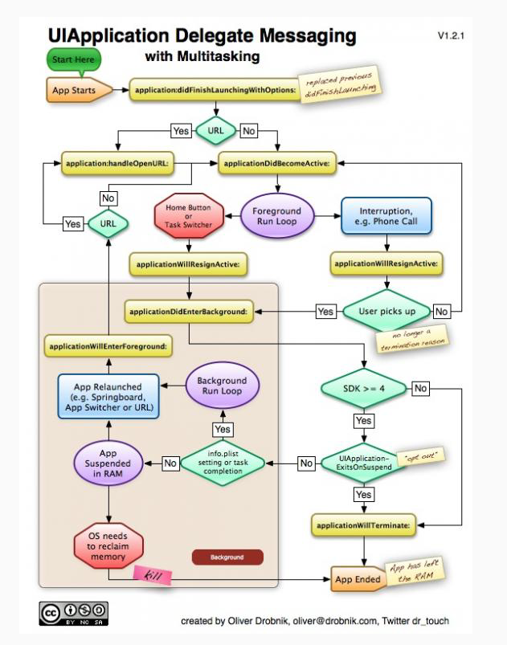
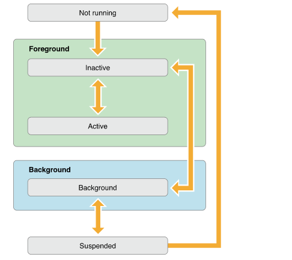
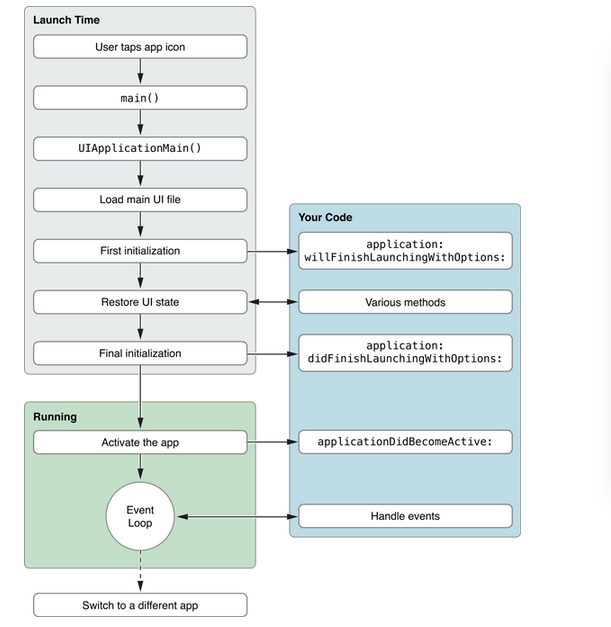
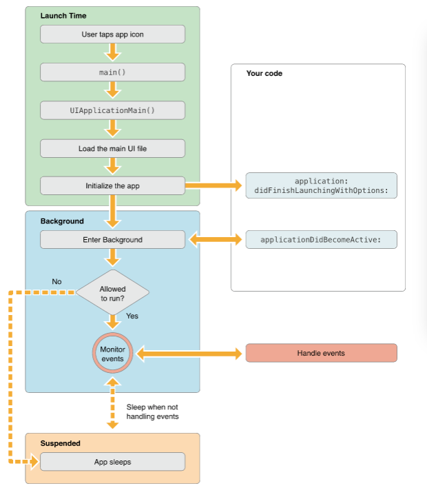
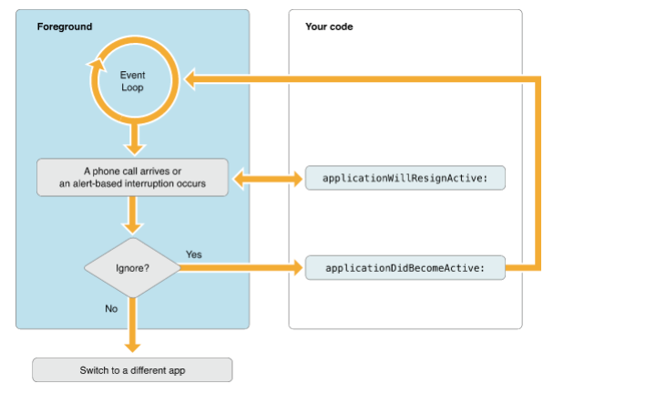
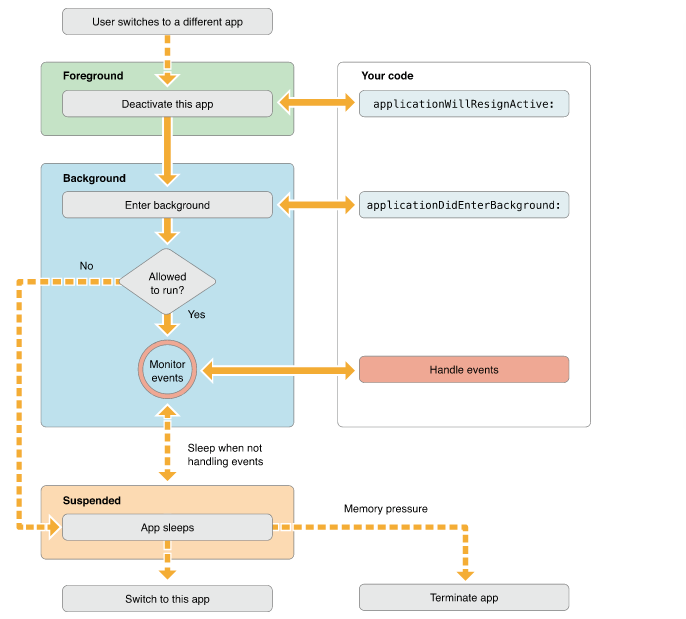
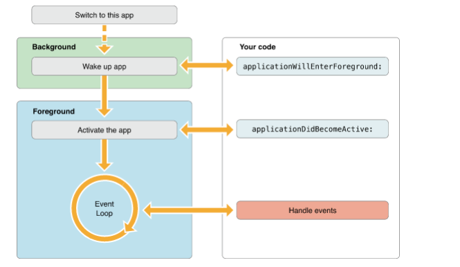
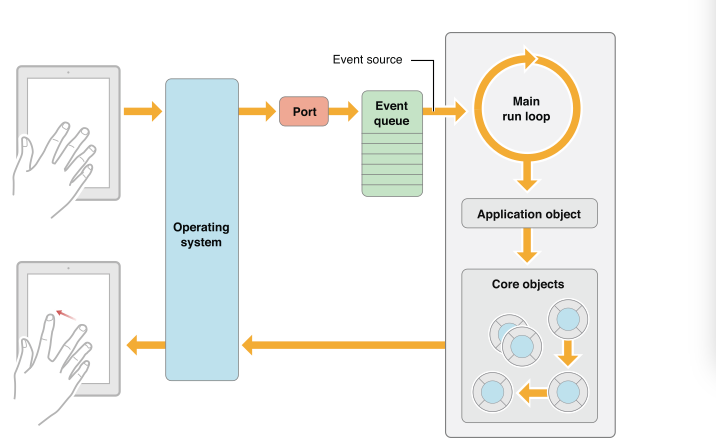

#ios生命周期
        iOS的应用程序的生命周期，还有程序是运行在前台还是后台，应用程序各个状态的
    变换，这些对于开发者都是很重要的。程序在后台时，会受到系统的很多限制，这样可以
    提高电池的使用和用户体验。

    
##1.应用程序的状态
        ① Not running：未运行，程序没启动；
        ② Inactive：未激活，程序在前台运行，不过没有接收时间，在没有事件处理情况下
    程序通常停留在这个状态；
        ③ Active：激活，程序在前台运行而且接收到了事件，这是程序的正常模式；
        ④ Background：后台，程序在后台而且能执行代码，大多数程序进入这个状态后会在
    这个状态停留一会，事件到了之后进入挂起状态，有的程序经过特殊的请求后可以长期
    处于Background状态；
        ⑤ Supspender：挂起，程序在后台不能执行代码，系统会自动把程序变成这个状态，
    而且不会发出通知。当挂起时，程序还是停留在内存中，当系统内存低是，系统会把挂起
    的程序清除掉，为前台程序提供更多的内存。
        以下是程序状态变化图

##2.应用程序各个状态的代理回调
        ① willFinishLaunchingWithOptions：进程启动但还没进入状态；
        ② didFinishLaunchingWithOptions：启动基本完成，准备开始运行；
        ③ applicationWillResignActive：应用程序将要进入非活动状态，在此期间，应用
    程序不接收消息或事件；
        ④ applicationDidBecomeActive：应用程序进入活动状态；
        ⑤ applicationDidEnterBackground：应用程序被推到后台的时候调用；
        ⑤ applicationWillEnterForeground：应用程序将要重新回到前台的时候调用；
        ⑥ applicationWillTerminate：应用程序将要推出，通常用来保存数据和一些推出前
    的清理工作；这个需要设置UIApplicationExitsOnSuspend的键值；
        ⑦ applicationDidFinishLaunching：程序载入后运行；
##3.应用程序的生命周期
        ① 加载应用程序进入前台

        ② 加载应用程序进入后台

        ③ 关于main函数
            main函数是程序启动的入口，在ios中，main函数的功能被最小化，他的主要工
        作都交给了UIKit.framework;
            在main方法中，启动main方法
            int main(int argc, char *argv[])  
            {  
                @autoreleasepool {  
                    return UIApplicationMain(argc, argv, nil, NSStringFromClass
                    ([MyAppDelegate class]));  
                }  
            }
            UIApplicationMain函数有四个参数：
            前两个参数包含了系统带过来的启动时间；
            第三个参数确定了主要应用程序类的名称，这里设为nil，表示使用默认的程序
        类UIApplication；
            第四个参数是程序自定义的代理类名，这个类负责系统和代码之间的交互。
##4.响应中断
        ① 当一个基于警告式的中断发生，比如打电话，这是程序会进入Inactive状态，处理的
    流程图如下：

        在ios中，通知不会把程序变为inactive状态，通知会显示在状态栏上，如果拉下状态
    栏，程序会变为Inactive状态；如果把状态栏放回去，程序变回active状态；
        按锁屏键也是另一种程序的中断，当按下锁屏键，系统屏蔽了所有的触摸事件，把app
    推到了后台，这是app的状态是Inactive，并进入后台。
        ② 当发生这些中断时，我们应该在applicationWillResignActive中处理一些工作：
            A.停止timer和其他周期性的任务；
            B.停止任何正在运行的请求；
            C.暂停视频的播放；
            D.如果是游戏，就暂停；
            E.减少OpenGL ES的帧率；
            F.挂起任何分发队列和不重要的操作队列
            当程序回到active状态，applicationDidBecomeActive应该重新开始上述任务。
##5.程序推到后台
        流程图如下：

        程序进入后台之后的处理：
        ① 保存数据信息；
        ② 释放内存：在后台每个程序都应该释放最大的内存，否则当内存不足时，系统会终
    止一些挂起的程序来回收内存，那些内存最大的程序首先被终止；
        这些操作在applicationDidEnterBackgound方法中执行，此方法大概有5秒钟的时间
    让你完成这些任务，如果超过时间还有未完成的任务，你的程序就会被终止而从内存中
    清除。如果需要长时间运行任务，可以调用beginBackgroundTaskWithExpirationHandler
    去请求后台运行时间。
##6.返回前台运行
        流程图如下：

        当app处于挂起状态时，他是不能执行任何代码的，因此他不能处理在挂起期间发过
    来的通知，比如方向改变，时间改变等。在程序返回前台时，程序都要处理这些通知。
##7.程序的终止
        app如果终止了，系统会调用app的代理方法 applicationWillTerminate，这样你可
    以做一些清理工作，这个方法也有5秒钟的限制，超时后方法会返回程序，从内存中清楚。
##8.main RunLoop 主运行循环
        main RunLoop负责处理用户相关的事件，UIApplication对象在程序启动时启动main
    RunLoop，他处理事件和更新视图的界面。
        main RunLoop处理事件的架构图如下：

        用户操作设备，相关的操作事件被系统生成并通过UIKit的指定端口分发。事件在内部
    排成队列，一个一个的分发到main RunLoop去做，UIApplication对象是第一个收到事件的 
    对象，他决定事件如何被处理。触摸事件分发到主窗口，窗口再分发到对应触摸事件的
    View。
        大部分的事件可以在你的应用内分发，类似触摸事件，远程操控事件（线控耳机等）
    都是由app得response对象处理的。
        ios中，response对象有UIApplication对象，view对象，ViewController对象等等；
        
        
    
