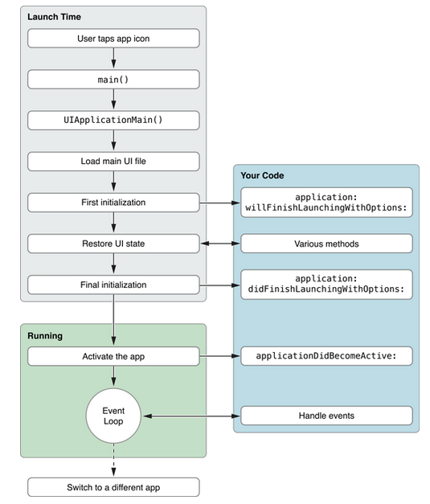

#ios生命周期
        iOS的应用程序的生命周期，还有程序是运行在前台还是后台，应用程序各个状态的
    变换，这些对于开发者都是很重要的。程序在后台时，会受到系统的很多限制，这样可以
    提高电池的使用和用户体验。
    
##1.应用程序的状态
        ① Not running：未运行，程序没启动；
        ② Inactive：未激活，程序在前台运行，不过没有接收时间，在没有事件处理情况下
    程序通常停留在这个状态；
        ③ Active：激活，程序在前台运行而且接收到了事件，这是程序的正常模式；
        ④ Background：后台，程序在后台而且能执行代码，大多数程序进入这个状态后会在
    这个状态停留一会，事件到了之后进入挂起状态，有的程序经过特殊的请求后可以长期
    处于Background状态；
        ⑤ Supspender：挂起，程序在后台不能执行代码，系统会自动把程序变成这个状态，
    而且不会发出通知。当挂起时，程序还是停留在内存中，当系统内存低是，系统会把挂起
    的程序清除掉，为前台程序提供更多的内存。
##2.应用程序的生命周期
        ① 加载应用程序进入前台

